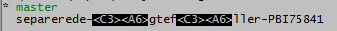

# Git

## Cloning

Start by cloning a repo from Github or Bitbucket.org.

```bash
git clone https://github.com/hocuspocus/icsharp.git
```

This will create a subfolder of the current folder name "aspnet-core-with-webpack" containing all the code.

## Edit configuration

On Windows the Git configuration file is usually placed under "c:\Users\\[user\]". You can also start an editor from the command prompt.

```bash
git config --global -e
```

### Set editor for commit messages

To change the default editor for commit messages to Notepad++, add a \[core\] section to the config file looking like this.

```text
[core]
    editor = 'C:/put-your-folder-here/Notepad++/notepad++.exe' -multiInst -notabbar
```

From now on Notepad++ will open when ever you run git commit without the -m switch.

### Set merge tool to Visual Studio

```text
[diff]
    tool = vsdiffmerge
[difftool]
    prompt = true
[difftool "vsdiffmerge"]
    cmd = \"C:\\Program Files (x86)\\Microsoft Visual Studio\\2017\\Professional\\Common7\\IDE\\CommonExtensions\\Microsoft\\TeamFoundation\\Team Explorer\\vsDiffMerge.exe\" \"$LOCAL\" \"$REMOTE\" //t
    keepbackup = false
    trustexistcode = true
[merge]
    tool = vsdiffmerge
[mergetool]
    prompt = true
[mergetool "vsdiffmerge"]
    cmd = \"C:\\Program Files (x86)\\Microsoft Visual Studio\\2017\\Professional\\Common7\\IDE\\CommonExtensions\\Microsoft\\TeamFoundation\\Team Explorer\\vsDiffMerge.exe\" \"$REMOTE\" \"$LOCAL\" \"$BASE\" \"$MERGED\" //m
    keepbackup = false
    trustexistcode = true
```

### Set pager to UTF-8

Output from Git may have problems showing Danish letters, for example for `git branch`.  Add the following to the \[core\] section of your global .gitconfig file:



```text
pager = LESSCHARSET=utf-8 less -R
```

### Create an alias for a command

If you are tired of typing long hard-to-forget commands you can create aliases.

```bash
git config --global alias.a "add ."
git config --global alias.c "commit"
```

You can now just type `git a` to add unstaged files.

Aliases can also be added directly to the config file.

```text
[alias]
    a = add .
    c = commit
```

## Submodules

### Cloning submodules

If the repo contains submodules, and you want to bring the code in the submodules down, you'll need to clone recursively.

```bash
git clone --recursive https://github.com/hocuspocus/icsharp.git
```

### Change submodule to own fork

If you have cloned a repo with a submodule and you want to change the submodule to a different fork \(if for example you have forked the submodul\), you need to edit the URL in the file .gitsubmodule.

```text
[submodule "Engine"]
    path = Engine
    url = https://github.com/scriptcs/scriptcs.git
```

After saving .gitsubmodule, run the command.

```bash
git submodule sync
```

It seems that this may detach from HEAD, so a checkout may be necessary \(before making any local changes\).

```bash
git checkout
```

If you have trouble downloading the code for the submodule, try running the command:

```bash
git submodule update --remote
```

## Start merge tool

If there is a merge tool, you can start your merge tool \(set in the config file\).

```bash
git mergetool
```

## Remote repo

### Compare to remote

Start by fetching all from the remote repo:

```bash
git fetch origin
```

Then compare with local:

```bash
git log HEAD..origin/master --oneline
```

If you are happy with the results, you may merge the remote changes with the local repo:

```bash
git merge
```

### Associate remote repo with local repo

Start by adding the remote:

```bash
git remote add <remote> <remote-url>
```

For example:

```bash
git remote add origin https://github.com/mynick/myremoterepo.git
```

Then clone the remote into your local repo:

```bash
git clone https://github.com/mynick/myremoterepo.git
```

Now you are ready for more commits and push.

If you somehow mess things up and get the dreaded "refusing to merge unrelated history", then try:

```bash
git pull --allow-unrelated-histories
```

### Change remote URL

Show remote URL for "origin":

```bash
git remote get-url origin
```

For at bit more information you may use:

```bash
git remote show origin
```

If your remote has moved, you can change the URL using _set-url_:

```bash
git remote set-url origin https://hocuspocus@bitbucket.org/myteam/myproject.git
```

## Branching

### Push new local branch to remote

After creating a new local branch and adding files to it, you can push the whole thing to remote.

```bash
git push -u origin feature_branch_name
```

You can do the same using _set-upstream_ like so.

```text
git push --set-upstream origin feature_branch_name
```

### Delete branch

Delete the remote branch:

```bash
git push -d <remote_name> <branch_name>
```

For example:

```bash
git push -d origin my-feature-branch
```

You may also use:

```bash
git push <remote_name> :<branch_name>
```

Delete the local branch:

```bash
git branch -d <branch_name>
```

### Track remote branch

```text
git checkout --track origin/name-of-remote-branch
```

### Create and switch branch in one step

As of Git 2.23 you can use

```bash
git switch -c new-branch
```

This is equivalent to

```bash
git checkout -b new-branch
```

## Delete local changes

Undo all unstaged local changes:

```bash
git checkout .
```

Undo git add for at single file:

```bash
git reset folder/file.cs
```

Undo `git add .` :

```bash
git reset .
```

## Undo latest commits

To undo the latest commit\(s\) use reset.

```bash
git reset @~N
```

Here _N_ is the number of commits to undo.  To undo the latest commit use reset @~1.

```bash
git reset @~1
```

A reset will leave changed files unstaged.

## Fix untracked files

```bash
git rm . -r --cached
git add .
git commit -m "Fix untracked files"
```

## Add annotated tags

```bash
git tag -a v1.1 -m "Version 1.1"
git push origin v1.1
```

## 


